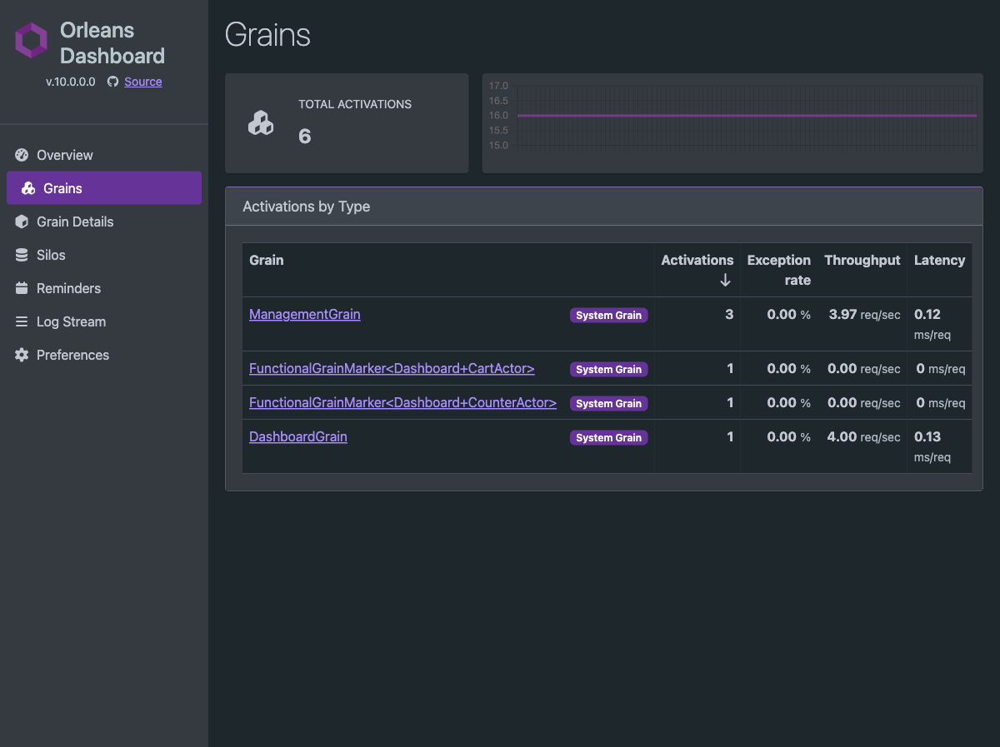

# Orleans Dashboard

Use Microsoft's Orleans Dashboard package with functional F# actors. The repository contains a runnable ASP.NET Core silo with `CounterActor` and `CartActor`.

## Install

```bash
dotnet add package Microsoft.Orleans.Dashboard
```

Keep the Dashboard package on the same Orleans version selected by the application.
Orleans Dashboard is a preview feature in Orleans 10, so re-run the smoke check when updating
Orleans even inside the supported range.

## Configure the silo

```fsharp
open Orleans.FSharp.Runtime

let config =
    siloConfig {
        useLocalhostClustering
        addMemoryStorage "Default"
        addDashboardWithOptions
            1000   // counter update interval in milliseconds (minimum 1000)
            100    // retained history points
            false  // keep the live trace endpoint visible
    }
```

`addDashboard` uses package defaults. `addDashboardWithOptions` configures `CounterUpdateIntervalMs`, `HistoryLength`, and `HideTrace` without taking a compile-time dependency from Orleans.FSharp.Runtime on the optional Dashboard package.

Register functional definitions as usual:

```fsharp
builder.UseOrleans(fun siloBuilder ->
    SiloConfig.applyToSiloBuilder config siloBuilder
    siloBuilder.AddFunctionalGrain(counterDefinition) |> ignore
    siloBuilder.AddFunctionalGrain(cartDefinition) |> ignore)
|> ignore
```

## Map the web endpoint

```fsharp
open Orleans.Dashboard

app.UseRouting() |> ignore
app.UseEndpoints(fun endpoints ->
    endpoints.MapOrleansDashboard("/dashboard") |> ignore)
|> ignore
```

Open `/dashboard/` after the host starts. The package must be present before Orleans builds its application manifest; the `siloConfig` Dashboard operations preload it at configuration time for that reason.

## What functional actors look like

The runnable example was exercised against the Dashboard Grains page. This is the exact current display:



| Application actor brand | Dashboard activation type | Dashboard category |
|---|---|---|
| `CounterActor` | `FunctionalGrainMarker<Dashboard+CounterActor>` | `System Grain` |
| `CartActor` | `FunctionalGrainMarker<Dashboard+CartActor>` | `System Grain` |

The actor brand is therefore visible, but the logical contract strings `dashboard.counter` and `dashboard.cart` are not the row labels. Dashboard currently reports the manifest implementation marker. The `System Grain` category is also Dashboard's current presentation of that marker; it does not change the actor's application behavior.

Functional API-record fields share the runtime's dispatch operation, so do not expect `increment`, `value`, `add`, and `count` to appear as four independently generated grain methods in the method profiler.

## Run the example

```bash
dotnet run --project examples/dashboard/Dashboard.fsproj
```

Then:

1. Open `http://127.0.0.1:5080/exercise` to activate both actors.
2. Open `http://127.0.0.1:5080/dashboard/#/grains`.

An automated registration, activation, and Dashboard HTTP smoke check is also available:

```bash
dotnet run --project examples/dashboard/Dashboard.fsproj -- --verify-silo
```

See the [complete example source](https://github.com/Neftedollar/orleans-fsharp/tree/main/examples/dashboard).

## Protect it in production

Do not expose the Dashboard anonymously on a public endpoint. Apply ASP.NET Core authentication and authorization to the mapped endpoint, or put it behind an authenticated operations network.

```fsharp
endpoints
    .MapOrleansDashboard("/dashboard")
    .RequireAuthorization()
|> ignore
```

For package status and platform-specific details, see the [official Orleans Dashboard documentation](https://learn.microsoft.com/dotnet/orleans/dashboard/).

## Next steps

- [Silo Configuration](silo-configuration.md)
- [Functional Grain Runtime](functional-grains.md)
- [Security](security.md)
