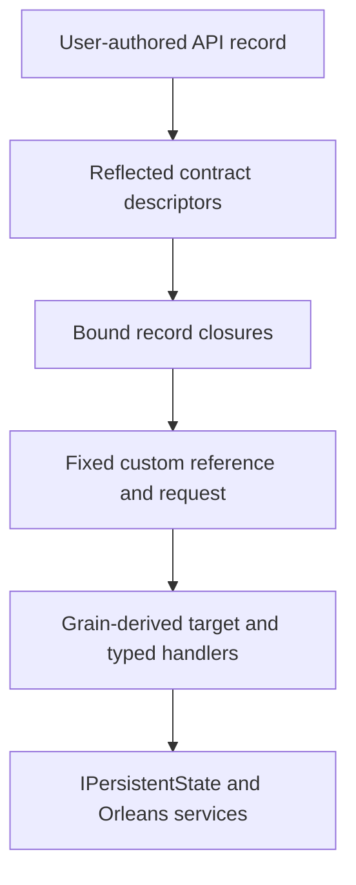

# Feature Proposal 003: Functional Grain Runtime with User-Authored API Records

**Status:** implementation proposal

**Target:** .NET 10, F# 10, Orleans 10.1.0 minimum; Orleans 10.2.2 must also pass

**Scope:** the new contracted, non-Journaled functional-grain path

## Read this first

This document is the implementation contract. It is intentionally explicit so
that it can be implemented without access to any design discussion which led to
it.

The central decision is:

> The application author writes an ordinary F# record of functions. Every field
> is an operation. The runtime binds that record to an Orleans grain reference.

The normal client experience inside a task computation must be:

```fsharp
task {
    let lobby = RoomApi.ref client (RoomId.create "general")

    do! lobby.join userId
    let! recent = lobby.history { take = 20 }
    return recent
}
```

There is no public operation witness, no `operation "join"`, no generated
`RoomApi`, and no generated `RoomApi.ref`. The record, its fields, IntelliSense,
and type checking exist immediately because the user writes the record.

The implementation must not replace any of the decisions in this document with
an alternative which seems easier. In particular, it must not restore a public
source-generation loop or the caller-selected `ask<'Reply>` API.

## Decision ledger

The following decisions are final for this proposal.

1. A contracted grain has a phantom actor type, a domain key type, and a
   user-authored F# API record.
2. Every API-record field is automatically an operation. The only supported
   field shape in the first version is `'Argument -> Task<'Reply>`.
3. Operation IDs default to record-field names. A compatible source rename uses
   `operationId "old-id" (_.newField)`.
4. `_.field` is the normative authoring syntax. It is the F# shorthand for
   `fun api -> api.field` supported by the repository's F# 10 toolchain.
5. Selectors are resolved by evaluating them once against a probe record and
   matching the returned function by sentinel identity. This proves which field
   was returned, not the lambda's source syntax. Do not use quotations, lambda
   IL inspection, generated accessors, or closure type names.
6. `GrainContract<'Actor,'Key,'Api>` is local immutable metadata. Its API binder,
   selectors, reflection data, and closures never go on the wire or into storage.
7. `grainType` is mandatory and explicit. It is never inferred from a module,
   record, assembly, or CLR type name.
8. A domain key wrapper lowers deterministically to a normal Orleans key. The
   resulting `GrainId` is the identity seen by routing and storage.
9. The new runtime uses stock Orleans routing, activation contexts, scheduling,
   placement, collection, lifecycle, storage, filters, reminders, timers, and
   request context. It does not implement a mailbox, scheduler, directory, or
   replacement `IGrainContext`.
10. Each application contract is represented in the silo manifest by a closed
    generic marker type. A custom `IGrainActivator` returns the actual F# target.
11. All contracts use one precompiled generic target interface, one fixed custom
    reference, and one fixed request/reply family. The target interface is closed
    over the actor brand and assigned an explicit stable Orleans interface ID.
    There is no per-contract transport generation and no application `.g.fs`.
12. The normal `FunctionalGrain.ref` API accepts `IGrainFactory`, so the same
    helper works from `IClusterClient` and inside another grain.
13. The first implementation supports only explicit contracts. The legacy
    `grain { ... }` API may coexist, but it is not silently converted into a new
    contractless runtime mode.
14. Ordinary persistence is part of this proposal. Journaled grains and Orleans
    transactions remain separate workstreams and their current bridges must be
    preserved.
15. Breaking protocol changes require an explicit contract-version change. The
    first version performs exact version matching; it does not claim automatic
    structural schema compatibility or mixed-version routing.

## Why this work is needed

The current universal non-event-sourced path is based on
`IFSharpGrain`/`IFSharpGrainWithGuidKey`/`IFSharpGrainWithIntKey` and the concrete
C# classes in `Orleans.FSharp.Abstractions/IFSharpGrainInterfaces.cs`. It routes
boxed messages through `IUniversalGrainHandler` and
`UniversalGrainHandlerRegistry`.

That path has structural limits which cannot be fixed by adding another helper:

- two definitions using the same universal interface and key can resolve to the
  same Orleans grain identity;
- actor identity does not include a definition-specific stable grain type;
- `ask<'Reply>` lets the caller select and then cast the reply type;
- the universal implementation keeps only in-memory `obj` state;
- persistence metadata, lifecycle hooks, timers, reminders, and cancellation do
  not run through the canonical universal activation;
- routing by incoming CLR message type does not naturally model independently
  typed operations, stable IDs, or per-operation scheduling policies.

There is also a generic F# `FSharpGrain<'State,'Message>` class in the runtime,
but requiring the application to author or generate one subclass per grain is
not the selected public model.

The existing `Orleans.FSharp.Generator` is not a general F# source generator. It
runs after an application assembly has compiled, scans event-sourced definitions,
and emits C# into the repository's CodeGen project. It cannot create a public
record which is available during the same F# type-checking session. It is not a
dependency of the runtime proposed here.

## Goals

- Immediate F# navigation, completion, and compile-time argument/reply checking.
- A different stable Orleans `GrainType` for every explicit grain contract.
- Typed handlers selected by the same API fields used by callers.
- Correct multi-silo routing and heterogeneous silo manifests.
- Ordinary durable state backed by Orleans `IPersistentState<'State>`.
- Stock Orleans scheduling and lifecycle behavior, including call filters and
  `RequestContext`.
- No reflection or selector resolution in the normal per-call hot path.
- A migration path which can coexist with current packages and samples.

## Non-goals and explicitly deferred work

The following are not hidden choices for the implementer. They are out of scope
for the first complete implementation of this proposal.

- A new contractless mode. Keep the existing simple API as legacy until a
  separate proposal defines a stable identity mechanism.
- Public API source generation, type providers, Myriad, or FCS-based code
  production.
- Automatic structural compatibility analysis of arbitrary Orleans serializers.
- Mixed contract-version routing. Version mismatch fails before handler code.
- Transactions. They require Orleans transaction request bases and transactional
  state, not a flag on the ordinary transport.
- Journaled/log-consistency replacement. Preserve the existing F# and C# bridge.
- Orleans response streaming (`IAsyncEnumerable`), implicit stream bindings,
  grain extensions, and observer API synthesis.
- NativeAOT/trimming support. The first implementation uses F# reflection and
  must document that limitation instead of claiming untested support.
- Making bound API records or their closures serializable/persistable.
- Explicit/implicit streams, broadcast channels, additional persistent states,
  stateless workers, custom placement policies, and activation migration. They
  require separate public API and state semantics proposals; this document must
  not leave their shape to the implementation agent.

## Terminology

| Term | Meaning |
|---|---|
| Actor brand | A phantom F# type, such as `RoomActor`, which prevents unrelated contracts from being mixed locally. It is never instantiated. |
| API record | A user-authored F# record whose fields are typed remote operations. |
| Contract | Immutable local metadata describing grain identity, key encoding, operations, version, and client-visible invocation policies. |
| Definition | Server-side value which binds every operation to a handler and supplies state, persistence, lifecycle, and hosting policy. |
| Selector | A function such as `_.join` with type `'Api -> ('Argument -> Task<'Reply>)`; one probe evaluation must return one field's sentinel by physical identity. |
| Bound API | A runtime-created value of the user's API-record type. Each field is a closure over one internal Orleans reference. |
| Marker | A closed CLR type added to the Orleans silo manifest for one contract. It is metadata, not the activation instance. |
| Target | The object returned by the custom activator and invoked by Orleans. |
| Transport envelope | An internal serializable request carrying contract version, operation ID, and payload. |

## Complete public experience

### Shared domain and contract

```fsharp
namespace Chat.Contracts

open System
open System.Threading.Tasks
open Orleans
open Orleans.FSharp

[<Struct>]
type UserId = private UserId of string

[<RequireQualifiedAccess>]
module UserId =
    let create value = UserId value
    let value (UserId value) = value

[<Struct>]
type RoomId = private RoomId of string

[<RequireQualifiedAccess>]
module RoomId =
    let create value = RoomId value
    let value (RoomId value) = value

type PostMessage =
    { author : UserId
      text : string }

type ChatMessage =
    { author : UserId
      text : string
      sentAt : DateTimeOffset }

type HistoryRequest = { take : int }

type Typing =
    { user : UserId
      isTyping : bool }

type PostError =
    | NotAMember
    | EmptyText

type RoomActor = private RoomActor of unit

[<NoEquality; NoComparison>]
type RoomApi =
    { join : UserId -> Task<unit>
      say : PostMessage -> Task<Result<int64, PostError>>
      history : HistoryRequest -> Task<ChatMessage list>
      typing : Typing -> Task<unit> }

[<RequireQualifiedAccess>]
module RoomApi =
    let contract : GrainContract<RoomActor, RoomId, RoomApi> =
        grainContract<RoomActor, RoomId, RoomApi>() {
            grainType "chat.room"
            version 1
            stringKey RoomId.value RoomId.create

            readOnly (_.history)
            oneWay (_.typing)
            alwaysInterleave (_.typing)
        }

    let ref : IGrainFactory -> RoomId -> RoomApi =
        FunctionalGrain.ref contract

    let rawRef :
        IGrainFactory ->
        RoomId ->
        FunctionalGrainRef<RoomActor, RoomId, RoomApi> =
        FunctionalGrain.rawRef contract
```

`[<NoEquality; NoComparison>]` is recommended because structural equality for a
record of functions is meaningless. The runtime must not require the attributes.

There is deliberately no `RoomApi.join` selector. An F# record field is an
instance property, not a generated module function. Use `_.join`.

### Server definition

```fsharp
module Chat.Server

open System
open System.Threading.Tasks
open Chat.Contracts
open Microsoft.Extensions.Logging
open Orleans.FSharp

type RoomState =
    { nextMessageId : int64
      members : Set<UserId>
      messages : ChatMessage list }

let roomDefinition =
    grainFor RoomApi.contract {
        defaultState (fun () ->
            { nextMessageId = 1L
              members = Set.empty
              messages = [] })

        persist "Default"
        collectionAge (TimeSpan.FromMinutes 30)

        handle (_.join) (fun _context state userId ->
            task {
                return
                    { state with
                        members = Set.add userId state.members },
                    ()
            })

        handle (_.say) (fun context state post ->
            task {
                if not (Set.contains post.author state.members) then
                    return state, Error NotAMember
                elif String.IsNullOrWhiteSpace post.text then
                    return state, Error EmptyText
                else
                    let message =
                        { author = post.author
                          text = post.text
                          sentAt = context.utcNow }

                    let id = state.nextMessageId

                    return
                        { state with
                            nextMessageId = id + 1L
                            messages = message :: state.messages },
                        Ok id
            })

        handle (_.history) (fun _context state request ->
            task {
                return
                    state,
                    state.messages
                    |> List.truncate (max 0 request.take)
                    |> List.rev
            })

        handle (_.typing) (fun context state typing ->
            task {
                context.logger.LogDebug(
                    "{User} typing={IsTyping}",
                    typing.user,
                    typing.isTyping)

                return state, ()
            })
    }
```

### Registration and calls

The hosting extension names and behavior are normative:

```fsharp
siloBuilder.AddFunctionalGrain(roomDefinition) |> ignore

clientBuilder.AddFunctionalGrainClient() |> ignore
```

These are `ISiloBuilder` and `IClientBuilder` extensions, respectively. Do not
add a raw `IServiceCollection.AddFunctionalGrain` overload: silo registration
must happen inside `UseOrleans`, after Orleans has installed its default manifest
providers, so provider order is deterministic.

`AddFunctionalGrainClient` idempotently registers the custom reference activator,
fixed request/reply serializers/copiers/activators, client transport validation,
and the repository's existing F# generalized codec/type filter through a new
`FSharpBinaryCodecRegistration.addCodecToSerializerBuilder` helper. Silo
registration first invokes the same client registration because grains make
outgoing calls, then adds definition/manifest/activation services. Multiple
definitions or repeated calls must not add competing codecs or duplicate
singleton instances.

Silo registration also calls
`TryAddSingleton<TimeProvider>(TimeProvider.System)`. An application registration
already present is preserved. The functional context resolves the guaranteed
service with `GetRequiredService<TimeProvider>()`; `utcNow` is exactly
`timeProvider.GetUtcNow()`. Do not use a hidden second wall clock or fail when the
application did not explicitly register one.

The new helper registers `FSharpBinaryCodec` as `IGeneralizedCodec` and its type
filter only; it does **not** register the current `IGeneralizedCopier`. That
copier returns outer F# containers unchanged and is not safe as a new global
copying policy for nested mutable values. Functional calls do not need it because
user values cross the explicit byte boundary. Keep the legacy
`addToSerializerBuilder` entry point behavior-compatible for existing callers;
make the two helpers share idempotent registration detection so enabling both
does not duplicate the codec. Repairing/replacing the legacy recursive copier is
separate work.

The extension does not register application contracts or definitions on an
external client and does not scan assemblies. The application still supplies its
ordinary `RoomApi.contract` value when binding a reference. After host
configuration, individual references require only `IGrainFactory`.

Both extensions call `AddOptions<FunctionalGrainTransportOptions>()`, validate
`MaxPayloadBytes > 0`, and use `ValidateOnStart`. Applications may configure the
public options through `siloBuilder.Services.Configure` or
`clientBuilder.Services.Configure` before the host is built; this is independent
of application-contract registration.

Client code and grain-to-grain code both use `IGrainFactory`:

```fsharp
task {
    let lobby = RoomApi.ref client (RoomId.create "general")

    do! lobby.join (UserId.create "alice")

    let! result =
        lobby.say
            { author = UserId.create "alice"
              text = "Hello from F#" }

    let! recent = lobby.history { take = 20 }
    return result, recent
}
```

Inside a handler:

```fsharp
let otherRoom = RoomApi.ref context.grainFactory otherRoomId
do! otherRoom.join userId
```

No generated application symbol appears in any example.

## Normative public types and computation-expression builders

The names and semantics below are normative. The code fence is an `.fsi`
signature sketch, not an `.fs` implementation file: opaque type declarations
and `val` declarations intentionally hide constructors and representations. The
current repository contains no conflicting `GrainContract`, `FunctionalGrain`,
or `FunctionalGrainRef` public symbol.

```fsharp
namespace Orleans.FSharp

open System
open System.Runtime.CompilerServices
open System.Threading
open System.Threading.Tasks
open Microsoft.Extensions.Logging
open Orleans
open Orleans.Hosting
open Orleans.Runtime

[<Sealed>]
type FunctionalGrainContext<'Actor, 'Key> =
    member key : 'Key
    member grainId : GrainId
    member grainFactory : IGrainFactory
    member services : IServiceProvider
    member logger : ILogger
    member timeProvider : TimeProvider
    member utcNow : DateTimeOffset
    member cancellationToken : CancellationToken
    member deactivateOnIdle : unit -> unit
    member delayDeactivation : TimeSpan -> unit
    member tryGetRequestContext<'Value> : name: string -> 'Value option
    member setRequestContext<'Value> : name: string -> value: 'Value -> unit
    member removeRequestContext : name: string -> unit

type OperationSelector<'Api, 'Argument, 'Reply> =
    'Api -> ('Argument -> Task<'Reply>)

type Handler<'Actor, 'Key, 'State, 'Argument, 'Reply> =
    FunctionalGrainContext<'Actor, 'Key> ->
    'State ->
    'Argument ->
    Task<'State * 'Reply>

type ActivateHook<'Actor, 'Key, 'State> =
    FunctionalGrainContext<'Actor, 'Key> ->
    'State ->
    Task<'State>

type DeactivateHook<'Actor, 'Key, 'State> =
    FunctionalGrainContext<'Actor, 'Key> ->
    DeactivationReason ->
    'State ->
    Task<unit>

type ReminderHook<'Actor, 'Key, 'State> =
    FunctionalGrainContext<'Actor, 'Key> ->
    'State ->
    TickStatus ->
    Task<'State>

type TimerHook<'Actor, 'Key, 'State> =
    FunctionalGrainContext<'Actor, 'Key> ->
    'State ->
    Task<'State>

type IFunctionalRequestMetadata =
    abstract GrainType : string
    abstract ContractVersion : int
    abstract OperationId : string
    abstract IsReadOnly : bool
    abstract IsOneWay : bool
    abstract IsAlwaysInterleave : bool
    abstract PayloadLength : int

[<Sealed>]
type FunctionalGrainTransportOptions =
    new : unit -> FunctionalGrainTransportOptions
    member MaxPayloadBytes : int with get, set

[<Sealed>]
type GrainContract<'Actor, 'Key, 'Api>

[<Sealed>]
type FunctionalGrainDefinition<'Actor, 'Key, 'Api, 'State>

[<Sealed>]
type FunctionalGrainRef<'Actor, 'Key, 'Api> =
    member key : 'Key
    member api : 'Api

    member call :
        selector: OperationSelector<'Api, 'Argument, 'Reply> ->
        argument: 'Argument ->
        Task<'Reply>

    member callCancellable :
        selector: OperationSelector<'Api, 'Argument, 'Reply> ->
        argument: 'Argument ->
        cancellationToken: CancellationToken ->
        Task<'Reply>

[<RequireQualifiedAccess>]
module FunctionalGrain =
    val ref :
        contract: GrainContract<'Actor, 'Key, 'Api> ->
        factory: IGrainFactory ->
        key: 'Key ->
        'Api

    val rawRef :
        contract: GrainContract<'Actor, 'Key, 'Api> ->
        factory: IGrainFactory ->
        key: 'Key ->
        FunctionalGrainRef<'Actor, 'Key, 'Api>

[<Sealed>]
type GrainContractDraft<'Actor, 'Key, 'Api>

[<Sealed>]
type GrainContractBuilder<'Actor, 'Key, 'Api> =
    member Yield :
        unit -> GrainContractDraft<'Actor, 'Key, 'Api>

    member Run :
        GrainContractDraft<'Actor, 'Key, 'Api> ->
        GrainContract<'Actor, 'Key, 'Api>

    [<CustomOperation("grainType")>]
    member GrainType :
        state: GrainContractDraft<'Actor, 'Key, 'Api> *
        value: string ->
        GrainContractDraft<'Actor, 'Key, 'Api>

    [<CustomOperation("version")>]
    member Version :
        state: GrainContractDraft<'Actor, 'Key, 'Api> *
        value: int ->
        GrainContractDraft<'Actor, 'Key, 'Api>

    [<CustomOperation("stringKey")>]
    member StringKey :
        state: GrainContractDraft<'Actor, 'Key, 'Api> *
        encode: ('Key -> string) *
        decode: (string -> 'Key) ->
        GrainContractDraft<'Actor, 'Key, 'Api>

    [<CustomOperation("guidKey")>]
    member GuidKey :
        state: GrainContractDraft<'Actor, 'Key, 'Api> *
        encode: ('Key -> Guid) *
        decode: (Guid -> 'Key) ->
        GrainContractDraft<'Actor, 'Key, 'Api>

    [<CustomOperation("int64Key")>]
    member Int64Key :
        state: GrainContractDraft<'Actor, 'Key, 'Api> *
        encode: ('Key -> int64) *
        decode: (int64 -> 'Key) ->
        GrainContractDraft<'Actor, 'Key, 'Api>

    [<CustomOperation("guidCompoundKey")>]
    member GuidCompoundKey :
        state: GrainContractDraft<'Actor, 'Key, 'Api> *
        encode: ('Key -> Guid * string) *
        decode: (Guid -> string -> 'Key) ->
        GrainContractDraft<'Actor, 'Key, 'Api>

    [<CustomOperation("int64CompoundKey")>]
    member Int64CompoundKey :
        state: GrainContractDraft<'Actor, 'Key, 'Api> *
        encode: ('Key -> int64 * string) *
        decode: (int64 -> string -> 'Key) ->
        GrainContractDraft<'Actor, 'Key, 'Api>

    [<CustomOperation("readOnly")>]
    member ReadOnly<'Argument, 'Reply> :
        state: GrainContractDraft<'Actor, 'Key, 'Api> *
        selector: OperationSelector<'Api, 'Argument, 'Reply> ->
        GrainContractDraft<'Actor, 'Key, 'Api>

    [<CustomOperation("oneWay")>]
    member OneWay<'Argument, 'Reply> :
        state: GrainContractDraft<'Actor, 'Key, 'Api> *
        selector: OperationSelector<'Api, 'Argument, 'Reply> ->
        GrainContractDraft<'Actor, 'Key, 'Api>

    [<CustomOperation("alwaysInterleave")>]
    member AlwaysInterleave<'Argument, 'Reply> :
        state: GrainContractDraft<'Actor, 'Key, 'Api> *
        selector: OperationSelector<'Api, 'Argument, 'Reply> ->
        GrainContractDraft<'Actor, 'Key, 'Api>

    [<CustomOperation("operationId")>]
    member OperationId<'Argument, 'Reply> :
        state: GrainContractDraft<'Actor, 'Key, 'Api> *
        stableWireId: string *
        selector: OperationSelector<'Api, 'Argument, 'Reply> ->
        GrainContractDraft<'Actor, 'Key, 'Api>

[<Sealed>]
type FunctionalGrainDefinitionSeed<'Actor, 'Key, 'Api>

[<Sealed>]
type FunctionalGrainDefinitionDraft<'Actor, 'Key, 'Api, 'State>

[<Sealed>]
type FunctionalGrainDefinitionBuilder<'Actor, 'Key, 'Api> =
    member Yield :
        unit -> FunctionalGrainDefinitionSeed<'Actor, 'Key, 'Api>

    member Run<'State> :
        FunctionalGrainDefinitionDraft<'Actor, 'Key, 'Api, 'State> ->
        FunctionalGrainDefinition<'Actor, 'Key, 'Api, 'State>

    [<CustomOperation("defaultState")>]
    member DefaultState<'State> :
        state: FunctionalGrainDefinitionSeed<'Actor, 'Key, 'Api> *
        factory: (unit -> 'State) ->
        FunctionalGrainDefinitionDraft<'Actor, 'Key, 'Api, 'State>

    [<CustomOperation("initialState")>]
    member InitialState<'State> :
        state: FunctionalGrainDefinitionSeed<'Actor, 'Key, 'Api> *
        factory: ('Key -> 'State) ->
        FunctionalGrainDefinitionDraft<'Actor, 'Key, 'Api, 'State>

    [<CustomOperation("handle")>]
    member Handle<'State, 'Argument, 'Reply> :
        state: FunctionalGrainDefinitionDraft<'Actor, 'Key, 'Api, 'State> *
        selector: OperationSelector<'Api, 'Argument, 'Reply> *
        handler: Handler<'Actor, 'Key, 'State, 'Argument, 'Reply> ->
        FunctionalGrainDefinitionDraft<'Actor, 'Key, 'Api, 'State>

    [<CustomOperation("persist")>]
    member Persist<'State> :
        state: FunctionalGrainDefinitionDraft<'Actor, 'Key, 'Api, 'State> *
        providerName: string ->
        FunctionalGrainDefinitionDraft<'Actor, 'Key, 'Api, 'State>

    [<CustomOperation("collectionAge")>]
    member CollectionAge<'State> :
        state: FunctionalGrainDefinitionDraft<'Actor, 'Key, 'Api, 'State> *
        age: TimeSpan ->
        FunctionalGrainDefinitionDraft<'Actor, 'Key, 'Api, 'State>

    [<CustomOperation("onActivate")>]
    member OnActivate<'State> :
        state: FunctionalGrainDefinitionDraft<'Actor, 'Key, 'Api, 'State> *
        hook: ActivateHook<'Actor, 'Key, 'State> ->
        FunctionalGrainDefinitionDraft<'Actor, 'Key, 'Api, 'State>

    [<CustomOperation("onDeactivate")>]
    member OnDeactivate<'State> :
        state: FunctionalGrainDefinitionDraft<'Actor, 'Key, 'Api, 'State> *
        hook: DeactivateHook<'Actor, 'Key, 'State> ->
        FunctionalGrainDefinitionDraft<'Actor, 'Key, 'Api, 'State>

    [<CustomOperation("onReminder")>]
    member OnReminder<'State> :
        state: FunctionalGrainDefinitionDraft<'Actor, 'Key, 'Api, 'State> *
        name: string *
        dueTime: TimeSpan *
        period: TimeSpan *
        hook: ReminderHook<'Actor, 'Key, 'State> ->
        FunctionalGrainDefinitionDraft<'Actor, 'Key, 'Api, 'State>

    [<CustomOperation("onTimer")>]
    member OnTimer<'State> :
        state: FunctionalGrainDefinitionDraft<'Actor, 'Key, 'Api, 'State> *
        name: string *
        options: GrainTimerCreationOptions *
        hook: TimerHook<'Actor, 'Key, 'State> ->
        FunctionalGrainDefinitionDraft<'Actor, 'Key, 'Api, 'State>

[<AutoOpen>]
module FunctionalGrainBuilders =
    val grainContract<'Actor, 'Key, 'Api> :
        unit -> GrainContractBuilder<'Actor, 'Key, 'Api>

    val grainFor :
        contract: GrainContract<'Actor, 'Key, 'Api> ->
        FunctionalGrainDefinitionBuilder<'Actor, 'Key, 'Api>

[<AbstractClass; Sealed; Extension>]
type FunctionalGrainHostingExtensions =
    [<Extension>]
    static member AddFunctionalGrain<'Actor, 'Key, 'Api, 'State> :
        builder: ISiloBuilder *
        definition: FunctionalGrainDefinition<'Actor, 'Key, 'Api, 'State> ->
        ISiloBuilder

    [<Extension>]
    static member AddFunctionalGrainClient :
        builder: IClientBuilder -> IClientBuilder
```

`grainContract` is deliberately a generic factory function, not a generic value;
the required spelling is
`grainContract<RoomActor, RoomId, RoomApi>() { ... }`. The definition CE uses a
typed seed: its first custom operation must be exactly one of `defaultState` or
`initialState`, which introduces and infers `'State`. Every later custom
operation carries the same `'State`. `Run` seals the CE and performs missing
contract fields, missing initializer, handler coverage, and duplicate validation.

Compound key encoders return ordinary F# reference tuples. Compound decoders are
intentionally curried; struct tuples and tupled decoders are not alternative
overloads. `onTimer` accepts one stock `GrainTimerCreationOptions`, whose
`DueTime`, `Period`, `Interleave`, and `KeepAlive` are frozen into the definition.
V1 rejects `Interleave = true` for a whole-state-returning timer hook.
`onReminder` accepts explicit `dueTime` and `period`; both are reconciled through
stock `RegisterOrUpdateReminder` on every successful activation.

`FunctionalGrain.ref contract factory key` is exactly
`(FunctionalGrain.rawRef contract factory key).api`.

The raw escape hatch remains selector-typed. Do not expose
`callById<'Reply>`, `ask<'Reply>`, or any API which lets the caller independently
choose the result type.

The primary bound-record methods do not accept a cancellation token because the
record field shape has exactly one domain argument. Advanced callers use
`rawRef.callCancellable`. The fixed request implements Orleans' cancellable
`IInvokable` contract and supplies a target-local .NET `CancellationToken`.
Cancellation is cooperative and does not roll back state or external effects.

```fsharp
let raw = RoomApi.rawRef client roomId
let! recent = raw.callCancellable (_.history) request cancellationToken
```

## API-record rules

`'Api` must be a public F# reference-record type with a public representation,
public record constructor, public field getters, and
`apiType.ContainsGenericParameters = false`. Non-public API records are not
supported in v1. A closed constructed generic record is allowed; an open type is
not. Every field must have exactly this shape:

```fsharp
'Argument -> Task<'Reply>
```

Rules for the first version:

- an operation with no domain input uses `unit -> Task<'Reply>`;
- an acknowledged operation with no result uses
  `'Argument -> Task<unit>`;
- multiple inputs are grouped in a record or tuple;
- `Async<'Reply>`, `ValueTask<'Reply>`, non-generic `Task`, curried multi-input
  functions, and non-function fields are rejected;
- all fields are remote operations; local helpers belong in the companion module;
- inherited properties, members, static members, and companion-module values are
  not operations;
- the API record and its bound closures are local facades, not grain instances or
  Orleans references, and are never serialized.

The contract constructor must reject an invalid API shape immediately. Do not
wait until host startup or the first call.

## Selector resolution

The documented and normative authoring forms are direct field projections:

```fsharp
_.join
fun api -> api.join
```

The selector's runtime acceptance rule is semantic, not syntactic: evaluating it
once with the probe record must return exactly one cached field sentinel by
physical identity. Consequently, these common wrapped forms fail because they
return a different function object or invoke the sentinel:

```fsharp
fun api argument -> api.join argument
fun api -> api.join >> logCall
fun _api -> somePreviouslyCapturedFunction
```

Reject a selector whose result is not a probe sentinel with a diagnostic which
includes:

```text
Use a direct API field selector such as _.join.
```

### Required algorithm

Create one cached `ApiShape` per closed API type:

1. Check `FSharpType.IsRecord(apiType, BindingFlags.Public)` and reject value
   records or records whose public representation is unavailable.
2. Read fields in declaration order with
   `FSharpType.GetRecordFields(apiType, BindingFlags.Public)`.
3. For each field, check `FSharpType.IsFunction(field.PropertyType)`.
4. Use `FSharpType.GetFunctionElements` to obtain the argument and range types.
5. Verify that the range is exactly `Task<'Reply>` and record `'Reply`.
6. Create a unique function object assignable to the exact declared field type
   with `FSharpValue.MakeFunction`. Its body throws if invoked.
7. Construct one probe record from those sentinels using a cached
   `FSharpValue.PreComputeRecordConstructor(apiType, BindingFlags.Public)`
   delegate.
8. Call the selector with the probe record.
9. Resolve the returned object by `Object.ReferenceEquals` against the sentinel
   objects.
10. Accept only exactly one match. A wrapper, eta-expansion, invocation,
    unrelated constant, or transformed function normally fails because it is not
    reference-equal to a sentinel.

Do not parse lambda IL, inspect generated closure names, compare `ToString()`, or
require quotations. TypeShape is not needed for this mechanism.

This mechanism cannot inspect source structure. A helper, side effect, captured
condition, or branch between two identically typed fields can still return an
original sentinel and therefore be accepted. Detecting those forms would require
quotations, generated witnesses, or IL/source inspection, all deliberately
excluded. Documentation must tell authors to use `_.field`; the runtime must not
claim to reject every other lambda shape.

Selector execution is therefore a validation convention. Contract and definition
construction must treat selectors as untrusted application code: execute them
exactly once, catch exceptions, wrap them in a clear contract diagnostic, and
never run them during ordinary bound-record calls. A selector with side effects
has unsupported application behavior even if it happens to resolve.

## Contract builder

A minimal contract is:

```fsharp
let contract =
    grainContract<RoomActor, RoomId, RoomApi>() {
        grainType "chat.room"
        stringKey RoomId.value RoomId.create
    }
```

### Defaults and validation

| Setting | Required behavior |
|---|---|
| `grainType` | Required exactly once, non-blank, and contains no NUL. Never inferred. Cross-contract uniqueness is checked when `AddFunctionalGrain` registers/finalizes the silo registry, because contract construction has no global view. |
| `version` | Optional, defaults to `1`, must be a positive `int`. |
| operation ID | Exact record-field name, ordinal and case-sensitive. |
| invocation | Acknowledged, non-read-only, non-interleavable. |
| key | One explicit native or wrapper codec. |
| placement/collection/persistence | Server-definition concerns, not client contract fields. |

All operations are discovered from the record before applying custom operations.
There is no `operation` custom operation.

Contract policy custom operations use selectors:

```fsharp
readOnly (_.history)
oneWay (_.typing)
alwaysInterleave (_.typing)
// After source field `join` has been renamed to `enter`:
operationId "join" (_.enter)
```

Each policy may be applied at most once per field. Duplicate declarations are
errors rather than silently idempotent.

Final operation IDs must be non-blank and contain no NUL because NUL is the
protocol-token delimiter. The same rule applies to explicit ID overrides.

### Operation identity and rename behavior

Default wire ID is the record-field name. After changing the API record field
from `join` to `enter`, the rename is therefore a protocol change unless the
updated contract contains:

```fsharp
operationId "join" (_.enter)
```

The first parameter is the stable wire ID; the selector identifies its current
source field. At most one ID override is permitted per field, and final wire IDs
must be unique.

Module name, API-record CLR name, actor-brand CLR name, declaration order, and
handler name do not participate in the operation ID.

An operation rename with an ID override preserves routing and storage identity,
provided argument, reply, behavior, and version compatibility are also
preserved. A breaking argument/reply/semantic change requires a contract-version
change. The runtime does not pretend to prove structural serializer compatibility.

### Contract version

Version is application protocol metadata carried in every transport envelope.
It is not part of the `GrainId`, storage key, or CLR marker name.

It is also not the Orleans transport-interface version. Every internal
functional target interface publishes fixed Orleans interface version `1`; the
custom reference provider uses the same fixed value even when an external client
has not registered application contracts. This keeps
`AddFunctionalGrainClient()` contract-free while application compatibility is
enforced by the envelope version.

The first implementation uses exact version equality:

- a target rejects a request whose version differs from its registered contract;
- the exception names grain type, expected version, received version, and
  operation ID;
- changing a version does not automatically route to a different activation;
- mixed-version rolling upgrades require an application deployment plan and are
  not claimed by this proposal.

### Key codecs and identity

The contract must support native string, `Guid`, `int64`, and their Orleans
compound forms. Compound encoders use ordinary F# reference tuples, not struct
tuples. Domain wrappers lower explicitly:

```fsharp
stringKey RoomId.value RoomId.create
guidKey CustomerId.value CustomerId.create
int64Key OrderId.value OrderId.create
```

The exact state-first custom-operation signatures are given in the normative
public builder surface above; do not add competing tuple/struct overloads.

Native keys use `id` in both directions. Compound decoders are curried only in
the key-codec configuration; remote API fields remain single-argument functions.
Reject null/blank compound extensions using Orleans' normal key rules.

Every codec is part of actor identity and must obey these laws for all accepted
domain keys/native keys:

- encoding is deterministic and injective in the selected Orleans native key
  space; two unequal domain keys must never silently address the same grain;
- `decode (encode key) = key` under the domain type's equality semantics;
- `encode (decode native) = native` in Orleans' canonical native
  representation, including the compound extension;
- decoding malformed or non-canonical values fails instead of normalizing two
  distinct inputs to one identity.

Injectivity cannot be proven generically by the runtime. It is an explicit codec
author obligation, documented next to these builders and covered by property
tests for every shipped/sample codec.

Internally a key codec produces and reads the same `IdSpan` representation used
by stock Orleans key helpers. It must validate null, empty, and malformed values
consistently with Orleans.

The stable actor identity is:

```text
GrainId(GrainType(contract.grainType), keyCodec.encode(domainKey))
```

Consequences which must appear in API documentation:

- a wrapper does not introduce a new Orleans key kind;
- Orleans routing and `IPersistentState` see a normal `GrainId`;
- changing `grainType` or the key codec changes actor identity and can orphan
  existing durable state unless data is migrated;
- changing record/module/actor-brand CLR names does not change identity when the
  explicit grain type and encoded key remain unchanged;
- version and operation ID are not storage-key components.

## Bound API construction

Reflection is permitted while constructing and caching shape metadata and while
binding a reference. It is not permitted on the normal call hot path.

Each operation descriptor contains:

- field index and source field name;
- stable operation ID;
- exact argument and reply `Type` values;
- invocation policy flags;
- a preclosed generic function which creates the correctly typed call closure;
- a preclosed generic server adapter which unboxes the expected argument and
  boxes the reply internally.

At `rawRef` construction:

1. Encode the domain key and construct the explicit `GrainId`.
2. Compute the contract's stable actor-specific `GrainInterfaceType` and call
   `IGrainFactory.GetGrain(grainId, grainInterfaceType)`; do not ask Orleans to
   choose an implementation from an open generic interface.
3. Ask the returned reference's injected codec provider to validate every exact
   argument/reply type for this contract; fail binding before returning a facade.
4. Create one `FunctionalGrainRef<'Actor,'Key,'Api>` around the contract, key,
   and returned custom `FunctionalGrainReference`.
5. Create one exact function value for every API field. It closes over that raw
   reference and its immutable operation descriptor.
6. Invoke the cached record constructor with the function array.
7. Store the resulting API record in the raw wrapper and return the same instance
   from `.api`.

The generic binder is closed once per operation descriptor, not on every call.
The implementation can use one reflective generic-method close while building
`ApiShape`, then call the resulting delegate normally.

The ordinary path `lobby.join value` must not:

- enumerate record fields;
- invoke a selector;
- use `MethodInfo.MakeGenericMethod`;
- look up an operation by string;
- dynamically select a reply type.

It calls an already bound typed closure. That closure serializes the argument to
the fixed request's byte payload, and the public result is a real
`Task<'Reply>`.

`raw.call (_.join) value` resolves the selector against the already cached probe
shape. This is a low-level/test escape hatch and is not the documentation-first
API.

## Handler and definition model

The baseline handler type is:

```fsharp
type Handler<'Actor, 'Key, 'State, 'Argument, 'Reply> =
    FunctionalGrainContext<'Actor, 'Key> ->
    'State ->
    'Argument ->
    Task<'State * 'Reply>
```

The public builder exposes `handle` as one tupled custom-operation member whose
generic selector and handler parameters are linked in the same member signature;
the exact `.fsi` shape appears above. Its semantic type relationship is:

```fsharp
OperationSelector<'Api, 'Argument, 'Reply> ->
Handler<'Actor, 'Key, 'State, 'Argument, 'Reply> ->
definition
```

Therefore the compiler ties handler argument/reply types to the selected record
field. The server cannot select an unrelated result type.

The definition builder must be typed by
`'Actor`, `'Key`, `'Api`, and `'State`. At definition sealing, it must require:

- exactly one `defaultState`/initial-state factory;
- exactly one handler for every operation in the contract;
- no handler for an unknown operation;
- at most one persistence configuration for primary state;
- unique reminder and timer names;
- valid actor-level policy combinations.

Internally normalize initialization to `'Key -> 'State`. `defaultState` accepts
`unit -> 'State`; `initialState` accepts `'Key -> 'State`. The factory is invoked
at most once per activation and only when the durable facet reports
`RecordExists = false` (or once for every ephemeral activation). A captured state
value is not a supported overload because it could share a mutable object graph
between keys or activations.

F# generic constraints cannot prove exhaustive record-field coverage without
generation. The mandatory definition-sealing and host-start validation provides
that guarantee. Do not describe it as a compiler guarantee.

### Functional grain context

`FunctionalGrainContext<'Actor,'Key>` is an immutable, per-invocation view. Create
a fresh view for each request, lifecycle callback, reminder, and timer callback;
never store the current cancellation token or RequestContext view in mutable
activation-wide state. It must expose, at minimum:

- `key : 'Key`, decoded once from `IGrainContext.GrainId.Key`;
- `grainId : GrainId`;
- `grainFactory : IGrainFactory`;
- activation `services : IServiceProvider`;
- `logger : ILogger` scoped to the definition/target;
- `timeProvider : TimeProvider` and convenience `utcNow`;
- the target-local `cancellationToken` for the current request;
- `deactivateOnIdle` and `delayDeactivation` wrappers;
- RequestContext read/write helpers;
- the exact members shown in the normative `.fsi`; v1 timers/reminders are
  declarative definition hooks rather than mutable context-owned APIs.

Stable activation services may be held by an internal activation-services object,
but the public context is the per-invocation facade over those services. Do not
serialize the context or any service object.

### Lifecycle, timer, and reminder hook shapes

Use ordinary `Task` functions and the same typed context. The normative hook
shapes are:

```fsharp
type ActivateHook<'Actor, 'Key, 'State> =
    FunctionalGrainContext<'Actor, 'Key> ->
    'State ->
    Task<'State>

type DeactivateHook<'Actor, 'Key, 'State> =
    FunctionalGrainContext<'Actor, 'Key> ->
    DeactivationReason ->
    'State ->
    Task<unit>

type ReminderHook<'Actor, 'Key, 'State> =
    FunctionalGrainContext<'Actor, 'Key> ->
    'State ->
    TickStatus ->
    Task<'State>

type TimerHook<'Actor, 'Key, 'State> =
    FunctionalGrainContext<'Actor, 'Key> ->
    'State ->
    Task<'State>
```

`onActivate` runs after persistent-state setup. Its returned state uses the same
durable write-before-completion rule as a mutating handler. `onDeactivate` is for
cleanup and does not return replacement state. Reminder/timer returned state uses
the mutating publication rule. Their failures follow stock Orleans reminder/timer
logging and retry/lifecycle semantics; do not invent a retry loop.

Declarative `onReminder name dueTime period hook` and
`onTimer name options hook` must reject duplicate/blank names. For reminders,
definition sealing rejects negative `dueTime` and non-positive `period`; silo
host validation also checks the period against its configured Orleans
`ReminderOptions.MinimumReminderPeriod`.

After state load/initialization, the optional activate hook, and its required
write all succeed, but before activation completes, the target awaits
`RegisterOrUpdateReminder(name, dueTime, period)` for each declared reminder in
declaration order. Re-activation idempotently reconciles the durable schedule to
the frozen definition. Removing/renaming a reminder from a definition does not
magically delete the old durable registration; that is an explicit deployment
migration which must unregister the old name first. Timers are activation-local
and recreated after successful activation; reminders are durable registrations
managed by Orleans.

The whole-state `TimerHook`/`ReminderHook` model has the same lost-update risk as
a mutating interleaved handler. V1 must reject
`GrainTimerCreationOptions.Interleave = true`
for state-returning functional timers. Reminder callbacks and timers run
non-interleaved with functional state mutation. A future revision may add an
explicit conflict/version model; it must not silently accept last-completion-wins.

### State publication rules

For an acknowledged mutating operation:

1. Await the handler.
2. If it failed, leave authoritative state unchanged.
3. If state is ephemeral, publish the returned state and return the reply.
4. If state is durable, retain the previous value, assign the returned value to
   `IPersistentState.State`, and await `WriteStateAsync` while the Orleans turn is
   still exclusive.
5. On write failure, restore the previous in-memory value if the activation
   remains alive, then rethrow. On success, the new value is authoritative.
6. Only after a successful write return the reply.

For `readOnly`:

- Orleans receives the read-only scheduling option;
- the F# dispatcher discards the handler's returned replacement state;
- it does not issue the automatic primary-state write;
- it cannot prevent in-place mutation or external side effects, so documentation
  must require observationally read-only handlers and immutable state values.

For `oneWay`:

- the API field's reply must be exactly `unit`;
- the client task means the message was handed to the local Orleans send path,
  not that the target executed or persisted it;
- the target still awaits its handler and any automatic persistence internally;
- target failures cannot be reported to that caller and must be logged/traced.

Handler failure is not a transactional rollback. In-place mutation which occurs
before failure cannot be undone. Examples and docs must prefer immutable F#
state.

## Internal runtime architecture



The shared API record exists on client and server for typing and descriptor
construction. The bound closure values never cross the transport boundary.

### Internal project ownership

| Concern | Project |
|---|---|
| Contracts, API shape, selectors, bound records, raw refs, public builders, descriptor-to-request binding | `src/Orleans.FSharp` |
| Closed target interface, fixed request/reply/reference types, primitive transport options, explicit transport serialization | `src/Orleans.FSharp.Abstractions` |
| Precompiled marker, frozen definition registry, manifest providers, custom activator, target, lifecycle, persistence, reminders, silo DI | `src/Orleans.FSharp.Runtime` |
| Unit tests | `tests/Orleans.FSharp.Tests` |
| Real-cluster/multi-silo/restart tests | `tests/Orleans.FSharp.Integration` |

Do not move the new runtime through `Orleans.FSharp.Generator` or the
sample-specific CodeGen build target.

Transport types in Abstractions are internal implementation details except for
the deliberately tiny read-only `IFunctionalRequestMetadata` filter interface
and public `FunctionalGrainTransportOptions` configuration class.
Grant `InternalsVisibleTo` only to `Orleans.FSharp`, `Orleans.FSharp.Runtime`, and
the necessary test assembly. Do not make envelopes, requests, references,
codecs, or serializer-session internals a documented application surface merely
to simplify cross-project access.

The dependency direction is fixed: `Orleans.FSharp` already references
`Orleans.FSharp.Abstractions`; Abstractions must never reference a
`GrainContract`, operation descriptor, API shape, or any type owned by the upper
F# project. The upper `FunctionalGrainRef` turns its descriptor into a fully
specified fixed request. The lower custom reference accepts only fixed transport
types and primitives and sends them. This rule prevents a project cycle and is a
required architecture test.

### Closed target interface and fixed request/reference

The contracted core requires no per-contract source generation. Use these
precompiled generic/fixed building blocks:

```text
FunctionalGrainMarker<'Actor>       // concrete Grain + IRemindable metadata class
IFunctionalGrainTarget<'Actor>      // IGrain-derived closed interface per actor
IFunctionalDispatchTarget           // non-generic actual dispatch seam
FunctionalGrainReference            // one non-generic reference subclass
FunctionalRequest                   // one ordinary request class
FunctionalReply                     // one ordinary reply envelope
```

The marker alone lives in `Orleans.FSharp.Runtime`, which already references
`Microsoft.Orleans.Reminders`. Keep the target interface and all fixed client
transport/reference types in Abstractions. Do not add the Reminders package to
Abstractions: that project intentionally owns SDK-generated universal proxies,
and the existing dependency boundary avoids its known reminder-generator
conflict.

`IFunctionalGrainTarget<'Actor>` inherits `IGrain` and has one dispatch method
accepting the transport envelope and target-local cancellation token.
`FunctionalGrainMarker<'Actor>` derives `Grain` and implements that interface
plus `IRemindable` for every contract.
Its CLR generic closure supplies
actor-specific method metadata; the wire interface ID is explicit and does not
depend on an assembly-qualified type name. The actual target also implements the
non-generic `IFunctionalDispatchTarget`, and the fixed request invokes that seam
without per-call reflection.

Both dispatch interfaces use the exact internal shape
`FunctionalRequestEnvelope * CancellationToken -> ValueTask<FunctionalReply>`;
`FunctionalRequest` derives from `Request<FunctionalReply>` and implements
`InvokeInner` by calling the non-generic target. Do not create one request class
per operation.

`FunctionalGrainReference` derives from stock `GrainReference`. It owns only the
protected Orleans send seam and an injected exact-type payload codec. Its
internal methods accept an already constructed `FunctionalRequest`, apply the
request's already selected options, and call protected
`InvokeAsync<FunctionalReply>` or protected void `Invoke`. It does not know a
contract or operation descriptor and must not retain mutable per-contract
metadata.

The upper `FunctionalGrainRef`/bound closure uses the injected codec to serialize
the exact argument into fresh bytes, validates the reply token, and deserializes
the exact reply type. It copies the descriptor's immutable primitive metadata
into every request. Thus a cached lower reference remains safe when obtained on a
contract-free external client.

A prefix-based `IGrainReferenceActivatorProvider` returns that one reference
class for every well-formed functional interface ID. It must not consult an
application contract registry: `AddFunctionalGrainClient()` is deliberately
contract-free. Application code receives only the bound API record or
`FunctionalGrainRef` wrapper.

The provider resolves the Orleans serializer service once and passes an internal
typed-payload codec into each reference activator. The codec creates or resets a
fresh `SerializerSession` for every independent argument/reply operation; a
mutable session is never shared across concurrent invocations. Do not try to
recover an `IServiceProvider` from the public `IGrainFactory` at call time. The
provider accepts only an interface ID with prefix
`orleans.fsharp.functional/` and a non-empty, NUL-free suffix which
ordinal-equals the supplied `GrainId.Type`; otherwise it declines so another
provider may handle the reference. On success it creates `GrainReferenceShared`
with fixed internal transport-interface version `1`.

Provider priority is explicit. In both `AddFunctionalGrainClient` and silo
registration, inspect the `IServiceCollection`; if the functional provider is
not already present, `Insert` its singleton descriptor immediately before the
first existing `IGrainReferenceActivatorProvider` descriptor. If no provider is
present, fail registration because Orleans defaults were not installed through
the required builder API. Do not use `Add` or `TryAddEnumerable` for this
provider. Microsoft DI preserves enumerable descriptor order, and Orleans
10.1/10.2 walks reference providers in that order and stops at the first
`TryGet = true`. Combined with the narrow prefix/suffix predicate, this makes the
functional reference win only for its reserved identities even when
`Microsoft.Orleans.Sdk` emitted a stock proxy provider for the generic target
interface. Generated proxy/invokable/serializer glue may remain present and
unused; no application code references it.

`FunctionalRequest` must provide valid Orleans call-filter metadata on both
sides. On the caller, the custom reference initializes its nonserialized closed
target-interface `Type` and `MethodInfo`. After deserialization, `SetTarget`
restores them from the actual target's one closed functional interface, stores
the non-generic dispatch target, and creates target cancellation state.
`GetInterfaceType`, `GetMethod`, `GetInterfaceName`, `GetMethodName`, and
`GetActivityName` must then be stable and non-null. Its wire serializer must not
serialize target objects, `Type`, `MethodInfo`, options backing fields, or
cancellation resources.

Expose two logical request arguments so filter metadata matches the dispatch
method: `GetArgumentCount()` returns `2`; index `0` returns/replaces the envelope;
index `1` returns/replaces the current .NET `CancellationToken`; all other indices
throw `ArgumentOutOfRangeException`. The token remains nonserialized and is
replaced with the target-local token in `SetTarget`.

The internal envelope implements a small public, stable, read-only
`IFunctionalRequestMetadata` interface exposing grain type, contract version,
operation ID, policy booleans, and payload length but never payload bytes.
Application filters may cast argument 0 to that interface, observe metadata,
use `RequestContext`, log, time, reject, or short-circuit calls. They are not
promised a public mutable envelope type and must not rewrite functional metadata;
`SetArgument(0, ...)` accepts only the exact internal envelope type and all
metadata is revalidated at dispatch. This preserves ordinary opaque filter
participation without exposing the user's deserialized object graph.

`IGrainFactory` is sufficient. Reference binding must:

1. construct the exact `GrainId` from contract grain type and encoded key;
2. construct the actor-specific stable `GrainInterfaceType`;
3. call public `IGrainFactory.GetGrain(grainId, grainInterfaceType)`;
4. verify/cast the returned addressable value to `FunctionalGrainReference`;
5. fill the user API record with typed closures.

Do not use a key-only `GetGrain` overload: many contracts intentionally share
the same generic interface definition.

### Transport envelope

Use bytes, not `obj`, for operation arguments and replies. This is a hard
decision.

The explicit codecs use these stable numeric field IDs. Declaration order is not
wire identity and must not be substituted for the IDs.

| Type | Field ID | Field | Exact wire value |
|---|---:|---|---|
| `FunctionalRequestEnvelope` | 0 | `grainType` | non-empty string, no NUL |
|  | 1 | `contractVersion` | positive signed 32-bit integer |
|  | 2 | `operationId` | non-empty ordinal string, no NUL |
|  | 3 | `protocolToken` | byte array of exactly 32 bytes |
|  | 4 | `admissionFlags` | one unsigned byte; bit layout below |
|  | 5 | `payload` | non-null byte array, possibly empty |
| `FunctionalReply` | 0 | `protocolToken` | byte array of exactly 32 bytes |
|  | 1 | `payload` | non-null byte array, possibly empty |

`admissionFlags` is normative:

| Bit | Hex | Meaning |
|---:|---:|---|
| 0 | `0x01` | read-only |
| 1 | `0x02` | one-way |
| 2 | `0x04` | always-interleave |
| 3–7 | `0xF8` | reserved; every request with any such bit set is rejected |

The codecs reject null required values, a token of any length other than 32,
unknown flag bits, duplicate fields, a missing field, or a field with the wrong
wire type. V1 encoders emit every field. Add binary golden vectors for both fixed
types and every supported flag combination.

The upper client closure serializes `'Argument` using the Orleans serializer and
copies the descriptor's primitive metadata into the envelope before creating the
request. The target validates grain type, contract version, operation, token,
flags, and payload-size limit before deserializing into the operation's known
`'Argument` type. It serializes `'Reply` to fresh bytes before returning.

This intentional byte boundary:

- keeps the fixed request wire type independent of user CLR/F# type names;
- ensures local calls cannot alias the caller's mutable graph;
- lets the target select the expected type before deserialization;
- avoids relying on generalized copying of a polymorphic `obj` field.

`protocolToken` is the raw 32-byte deterministic SHA-256 digest of the UTF-8
sequence `grainType NUL version NUL operationId NUL direction`. It
detects descriptor misrouting; it is not a structural schema fingerprint and
must not be documented as one.

Encode `version` as invariant ASCII decimal with no sign/leading zero, and use
the exact lowercase direction literals `request` and `reply`. Grain type and
operation ID use their exact ordinal strings. Add golden-vector tests so client
and silo implementations cannot drift.

Normative sample vectors, written as lowercase hexadecimal for test assertions:

| Input | SHA-256 bytes as hex |
|---|---|
| `chat.room NUL 1 NUL join NUL request` | `525f112d5114016be421e973fee8aa7e4b439b560f29b419fd374e48336c430e` |
| `chat.room NUL 1 NUL join NUL reply` | `2a2e7b5513cb992ef81759d0e761ef0071ec634be2d8d3b0931f961641ad61bf` |

Add `FunctionalGrainTransportOptions.MaxPayloadBytes`, defaulting to 16 MiB, and
enforce it before allocation/copy where length is known and always before typed
deserialization. A request must satisfy both the caller's send limit and target
silo's receive limit; a reply must satisfy both the silo's send limit and the
caller's receive limit. The effective directional limit is therefore the minimum
of the two independently configured endpoints, though neither endpoint needs to
discover the other's value. Orleans' own message-size limit may be stricter and
may reject first. An oversized-payload diagnostic reports grain type, operation,
direction, actual size, and the local configured limit without logging bytes.

Write explicit serializers/copiers/activators for the small fixed transport
types. Do not use TypeShape to serialize transport targets, references, options,
cancellation state, or delegates. User payload bytes are produced by Orleans'
registered serializers for the exact argument/reply types. Every top-level
serialize or deserialize operation obtains a fresh/reset serializer session and
returns it in `finally`; never share a mutable session across concurrent calls.

The explicit local-call copier must preserve envelope, dynamic options, caller
cancellation token, and caller-side closed interface/method metadata, while
clearing any target object or target-local cancellation source. The wire codec
serializes only the fixed wire fields and restores options from serialized
admission flags. Treat internal payload arrays as immutable after construction.

### Dynamic scheduling options

`FunctionalRequest` derives from the appropriate stock Orleans ordinary request
base and sets `RequestBase.Options` from its validated envelope admission flags
before send; the lower request does not own an operation descriptor.
In Orleans 10.1/10.2, `MessageFactory` copies `OneWay`, `ReadOnly`, and
`AlwaysInterleave` into message headers before request serialization.

The same admission flags are serialized inside the request so the target can
validate them and so server-side request metadata can restore them after
deserialization. Target validation cannot undo scheduling which already happened,
so this follows the ordinary Orleans trusted-client/trusted-silo boundary.

One-way calls must use the reference's void `Invoke` path and return an already
completed `Task<unit>` (for example `Task.FromResult(())`) after local send.
Calling `InvokeAsync` with a one-way flag is not the selected implementation.

Do not implement `Unordered`; Orleans 10 documents it as obsolete/no-effect.
Transactions need a separate request derived from Orleans transaction request
bases and are not part of this ordinary request.

### Cancellation

`FunctionalRequest` implements Orleans' cancellable invokable contract directly:

- the caller-side nonserialized field contains the supplied .NET
  `CancellationToken`;
- `GetCancellationToken` returns it;
- `IsCancellable` is true for acknowledged calls;
- `SetTarget` creates the target-local cancellation source/token and resolves the
  actual target;
- `TryCancel` cancels the target-local source;
- `Dispose` disposes request-owned cancellation resources.

The target places its local token in `FunctionalGrainContext.cancellationToken`.
`raw.callCancellable` uses this mechanism. `Task.WaitAsync(token)` alone is not
remote cancellation and must not be used as a substitute.

For a normal bound API call, the request uses `CancellationToken.None`. A future
`refWith CallOptions` rebinding helper may offer a more ergonomic cancellation
surface, but it is not required by this proposal and must still use the same
request contract.

One-way calls support only an already-cancelled/pre-send check, returned as
`Task.FromCanceled<unit>(token)`. Otherwise the reference sends through protected
void `Invoke` and returns `Task.FromResult(())`. They cannot be remotely cancelled
after send; a token which becomes cancelled later is ignored and is not an
error. `callCancellable` follows this rule even when
`token.CanBeCanceled = true`; there is no separate rejection path. One-way
validation compares the extracted reply type with `typeof<unit>`; it does not
confuse F# `Task<unit>` with non-generic `Task` or CLR `Void`.
The target context for a delivered one-way request uses
`CancellationToken.None`; the request does not allocate target cancellation
state which no caller can signal.

Phase 0 must prove cancellation across two silos on both supported Orleans
versions. If this exact public invokable seam does not work, stop and report it;
do not serialize a .NET cancellation token into payload bytes.

### Marker, interface, and manifest registration

Use one concrete open generic marker:

```text
IFunctionalGrainTarget<'Actor> : IGrain
FunctionalGrainMarker<'Actor> :
    Grain, IFunctionalGrainTarget<'Actor>, IRemindable
```

It must be concrete: `GrainTypeResolver` rejects abstract classes. The marker is
metadata and is not instantiated in the successful functional activation path.
Give it a public parameterless constructor so Orleans can construct its default
activator before the functional configurator replaces it; its dispatch method
throws an explicit internal-error exception if the marker is ever instantiated.

For every registered definition:

1. Close marker and target-interface generic definitions over the actor brand.
2. Add only those closed types to `GrainTypeOptions.Classes` and
   `GrainTypeOptions.Interfaces`.
3. In `IPostConfigureOptions<GrainTypeOptions>`, remove the open marker and open
   target-interface definitions which default discovery can add.
4. Map the exact closed marker to `GrainType.Create(contract.grainType)` with a
   registry-backed `IGrainTypeProvider`.
5. Map the exact closed target interface to
   `GrainInterfaceType.Create("orleans.fsharp.functional/" + grainType)` with a
   registry-backed `IGrainInterfaceTypeProvider`.
6. Publish fixed internal transport-interface version `1` and the default grain
   type through `IGrainInterfacePropertiesProvider` using Orleans well-known
   property keys. Do not put application contract version in that property.
7. Publish implemented interface, placement, collection, and other actor
   properties through an `IGrainPropertiesProvider`.

`ISiloBuilder.AddFunctionalGrain` performs registration through
`builder.ConfigureServices`. In both supported Orleans versions the silo builder
has already installed default services before user `UseOrleans` configuration.
Register the two enumerable services exactly once with `TryAddEnumerable`:

```csharp
ServiceDescriptor.Singleton<IGrainPropertiesProvider,
    FunctionalGrainPropertiesProvider>()

ServiceDescriptor.Singleton<IPostConfigureOptions<GrainTypeOptions>,
    FunctionalGrainTypeOptionsPostConfigure>()
```

Microsoft DI preserves `IEnumerable<IGrainPropertiesProvider>` registration
order, and `SiloManifestProvider` invokes that sequence in order. Therefore this
builder-only API appends the functional provider after Orleans'
`ImplementedInterfaceProvider`. Orleans 10.1/10.2 expose no separate priority
property. This is why a raw/pre-Orleans `IServiceCollection` overload is
prohibited; final-manifest tests are the regression guard for the ordering seam.

Orleans' default `ImplementedInterfaceProvider` normalizes a closed interface on
a generic marker back to the open generic interface definition. Therefore the
functional grain-properties provider must run last, remove the false open
functional-interface entry, and publish the exact actor-specific closed
interface ID. This is mandatory, not an optimization.

Concretely, inspect only keys beginning with
`WellKnownGrainTypeProperties.ImplementedInterfacePrefix`. Find the single value
equal to the resolver's open functional-interface ID and replace that value in
the same key with the registered closed interface ID. Preserve entries for
`IRemindable` and any other deliberately advertised interfaces. Zero or multiple
matching entries is a startup error, not a reason to append another ambiguous
property.

Validate that one actor-brand CLR type maps to exactly one contract. Validate
that one explicit grain type maps to exactly one contract. The stable interface
ID is derived only from explicit grain type, not from the actor-brand name.

The registry is one singleton mutable-at-configuration object. In
`FunctionalGrainTypeOptionsPostConfigure.PostConfigure`, and only for
`Options.DefaultName`, atomically/idempotently freeze it into one immutable
snapshot, then remove open marker/interface definitions and add the registered
closed types. `IPostConfigureOptions` runs after all `IConfigureOptions`,
including Orleans' `DefaultGrainTypeOptionsProvider`. `SiloManifestProvider`
touches `GrainTypeOptions.Value` before enumerating classes/properties, so this is
the freeze point. Do not freeze in `IConfigurationValidator`, which may run too
late. Every resolver, properties provider, and activator reads only the frozen
snapshot; registration after freeze throws.

An external client needs no application registry and no GrainTypeOptions
post-configurer. Public `IGrainFactory.GetGrain(GrainId, GrainInterfaceType)`
calls the prefix reference activator directly without consulting the client
manifest. This contract-free behavior must be proven on both Orleans versions.
Heterogeneous silos register and advertise only definitions they actually host.

### Custom activation without a custom context

Register an `IConfigureGrainTypeComponents` implementation which recognizes
functional grain types from the frozen registry and installs a custom
`IGrainActivator`. Leave every non-functional grain type unchanged.

The marker is concrete so constructing Orleans' default activator is harmless if
the default configurator runs first. The functional configurator then replaces
the shared activator. If the functional configurator runs first, the default one
must observe the existing activator and leave it in place. Add an ordering test
instead of relying on undocumented DI coincidence.

`IGrainActivator.CreateInstance(IGrainContext)` returns an F# object expression
which derives from internal `FunctionalGrainTargetBase : Grain` and implements
the exact closed `IFunctionalGrainTarget<'Actor>` plus `IRemindable`.

Immediately after construction and before returning the target or starting any
lifecycle work, assert that
`Object.ReferenceEquals((target :> IGrainBase).GrainContext, grainContext)`.
`IGrainBase.GrainContext` is get-only; never try to assign it after construction.
Using the parameterless `Grain()` constructor is also prohibited because the
custom activator must not depend on ambient `RuntimeContext.Current`.

The precompiled marker cannot conditionally add a CLR interface per definition,
so all functional markers/targets advertise `IRemindable`. A definition with no
matching reminder handler performs no registration; receiving an unknown/stale
reminder name logs the stable grain/reminder identity and fails explicitly. It
must never route to an arbitrary handler. This is also why removing a durable
reminder requires the migration step described above.

The base class contains no application behavior. It exists because
`Grain.DelayDeactivation` is protected and is not available through
`IGrainBase`; it exposes narrow internal wrappers for `DeactivateOnIdle` and
`DelayDeactivation` to the immutable functional context. Do not fake
`delayDeactivation` with timers or a custom context.

Its constructor is normative:

```fsharp
type internal FunctionalGrainTargetBase
    (grainContext: IGrainContext, grainRuntime: IGrainRuntime) =
    inherit Grain(grainContext, grainRuntime)
```

Both Orleans 10.1.0 and 10.2.2 expose that protected `Grain` constructor. The
custom activator resolves `IGrainRuntime` from
`grainContext.ActivationServices`, passes both values when constructing the
object expression, and fails activation if the runtime service is absent. This
makes inherited `GrainFactory`, reminder registration, and protected
deactivation APIs valid deterministically.

The actual object need not have the marker CLR type. It must derive from the
internal base and implement every interface expected by the request and by
call-filter method mapping. Stock Orleans still supplies its `IGrainContext`;
the base is not a replacement activation context.

Do not implement a custom `IGrainContext`. Stock Orleans `ActivationData` remains
responsible for the activation scheduler, request queue, lifecycle, collection,
migration, activation services, and disposal.

This seam is not yet proven in this repository. Phase 0 is a mandatory stop/go
gate covering direct calls, global filters, lifecycle, deactivation, and
disposal. Failure blocks the architecture; it does not authorize a private actor
runtime.

### Typed dispatch

The target processes an ordinary request in this order:

1. Validate fixed envelope shape, grain type, contract version, payload size,
   token length, and absence of unknown admission bits. Do not deserialize user
   bytes yet.
2. Resolve the immutable operation descriptor by ordinal operation ID; an
   unknown ID fails here.
3. Compare the request protocol token and exact admission flags with that
   descriptor. This comparison cannot occur before descriptor lookup.
4. Deserialize bytes in a fresh serializer session to the descriptor's exact
   argument type.
5. Create the immutable per-invocation context with this request's target-local
   cancellation token, then invoke the preclosed typed handler adapter.
6. Apply the state publication/persistence rule.
7. Serialize the exact reply type in a fresh session, enforce the silo reply-size
   limit, and return the descriptor's precomputed reply token plus fresh payload.

The client validates reply shape, exact reply token, and its local reply-size
limit before deserializing the exact registered reply type. No user payload
deserialization or handler code runs before step 4; filter-modified envelope
metadata is revalidated through the same sequence.

There is one operation-ID dictionary lookup per wire call. There is no API-record
reflection, handler search by CLR message type, or caller-selected reply cast.

### Persistence and lifecycle ordering

The definition-specific activator must synchronously create
`IPersistentState<'State>` through `IPersistentStateFactory.Create<'State>` before
returning the target. The persistent-state object subscribes to Orleans lifecycle
at `GrainLifecycleStage.SetupState`; creating it later is incorrect.

`persist providerName` has one exact meaning in v1: enable the primary
`IPersistentState<'State>` facet with fixed state name `"state"` and the supplied
non-blank Orleans storage-provider name (the complete example uses
`"Default"`). The state name is deliberately not configurable in v1. Changing
grain type/key codec, state name, or provider can address different stored data
and is a storage-breaking migration concern.

Register all custom lifecycle observers before `ActivationData` starts lifecycle
`OnStart`. Required ordering is:

1. custom activator creates persistent facets, resolves `IGrainRuntime`, and
   constructs the target through the context/runtime `Grain` base constructor;
   only then may it return;
2. stock lifecycle loads state at SetupState;
3. actual target's `IGrainBase.OnActivateAsync` initializes missing/ephemeral
   state after lifecycle start;
4. functional `onActivate` observes loaded/initialized state and its returned
   durable state is written before activation continues;
5. declared reminders are reconciled and declared timers are registered;
6. activation completes and Orleans may admit ordinary turns;
7. on deactivation, target hook runs before lifecycle `OnStop` and timers are
   disposed;
8. `IGrainActivator.DisposeInstance` disposes the actual target last.

`IPersistentState<'State>.State` is authoritative. Do not maintain a second
independent state copy which can drift from it.

Required persistence behavior:

- without `persist`, invoke the initial-state factory once for every activation
  before the functional activate hook;
- with `persist`, wait for SetupState load; if `RecordExists = false`, invoke the
  factory once, assign that value, run the optional activate hook, and await one
  `WriteStateAsync` before activation succeeds, even when no activate hook exists;
- if `RecordExists = true`, start from loaded state; if an activate hook is
  configured, publish and persist its returned state before activation succeeds,
  otherwise do not issue an activation-time write;
- a mutating acknowledged handler publishes and awaits `WriteStateAsync` before
  returning success;
- on a failed write, restore the previous in-memory value if Orleans does not
  already invalidate/deactivate the activation;
- read-only/state-neutral operations do not replace or automatically write state;
- storage/ETag failures flow through Orleans' normal failure path;
- tests prove deactivation and real silo-restart recovery.

The durable record therefore exists by the time the first activation completes
successfully. Factory or initial write failure fails activation through Orleans;
do not expose a half-initialized target.

### Serialization and copying

Silo host validation proves serializer availability for every registered
argument, reply, and durable state type. Contract-free client startup can prove
only the fixed transport types. On the first `rawRef`/bound-record construction
for a concrete contract, the custom reference's injected codec provider validates
all argument and reply types and caches the result per contract shape and
serializer-service instance. It fails before returning the bound API, with a
diagnostic naming grain type, operation, direction, and CLR type. Do not claim an
external client validates application types it was never given.

The request/reply byte boundary guarantees that even local calls deserialize a
fresh payload graph. Add tests for F# records, unions, options, and lists which
contain `byte[]`, ref cells, or mutable objects. Do not depend on the current
`FSharpBinaryCodec.DeepCopy` behavior which returns outer F# containers unchanged.

Never serialize API records, functions, contracts, definitions, selectors,
reflection metadata, contexts, services, targets, references, or cancellation
sources.

## Validation responsibilities

### The F# compiler guarantees

- the key supplied to `RoomApi.ref` has the domain key type;
- bound field arguments and replies match the API record;
- handler argument/reply types match the selected field;
- a selector from an unrelated API cannot satisfy the expected selector type.

### Contract construction guarantees

- the API is a supported record and every field has the exact function shape;
- grain type, version, and key codec are valid;
- every policy selector returns exactly one probe sentinel by physical identity;
- final operation IDs are unique;
- policy declarations are not duplicated;
- one-way reply is exactly `unit`;
- invalid operation-policy combinations are rejected.

### Definition sealing and host startup guarantee

- every operation has exactly one handler;
- every hosted grain type, actor brand, and stable interface ID is unambiguous;
- all server argument/reply/state serializers are available; an external client
  validates its concrete contract types at binding because client startup is
  contract-free;
- persistence and named providers exist;
- marker, interface, manifest properties, definition, and activator agree;
- the registry is frozen before Orleans consumes it.

### Runtime guarantees

- request metadata is checked before payload deserialization and handler code;
- payload/reply types come only from the registered descriptor;
- handler and persistence failures use Orleans' normal exception path;
- target validation detects a method-family/admission-policy mismatch, while
  documenting that pre-admission scheduling already assumes a trusted caller.

Errors discoverable during construction/startup must not wait for the first call;
client application-type errors which require a concrete contract must fail while
binding that contract, before the bound API is returned.

## Concurrency and policy rules

Reject at least these combinations:

- `oneWay` when reply type is not `unit`;
- `oneWay + readOnly`;
- `oneWay + transactional`;
- `alwaysInterleave` unless the operation is `readOnly` or `oneWay`;
- durable state/reminders/migration with stateless-worker placement;
- unsupported transaction or response-streaming metadata;
- persisted definition without its named storage provider.

The functional handler model returns a whole next state after an await. Two
interleaved mutating handlers would otherwise produce last-completion-wins state
and possibly concurrent ETag writes. Therefore the first version makes every
`alwaysInterleave` operation state-neutral:

- `readOnly` already discards replacement state and skips automatic persistence;
- `oneWay + alwaysInterleave` also discards replacement state and skips automatic
  persistence.

The `typing` example is therefore safe: it performs logging/external work and its
returned state is ignored. A one-way operation without `alwaysInterleave` may
still mutate/persist state sequentially.

Discarding replacement state cannot prevent in-place mutation of a mutable state
graph. State-neutral/interleavable handlers must treat state as immutable and
must not mutate objects reachable from it; this is a documented programming
contract and must have a deliberately failing/unsafe example in guidance.

Do not implement actor-wide reentrancy or arbitrary `MayInterleave` for mutating
functional handlers in the core release. They need a separate revision/conflict
semantic and tests. If selective state-neutral `MayInterleave` is added later,
the marker can expose one static predicate over serialized request admission
hints; it must not consult a process-global registry because multiple isolated
silos can run in one process.

## Orleans capability mapping

| Capability | Required approach | Release |
|---|---|---|
| Grain identity/routing | Explicit grain type + native key + exact GrainId/interface ID | Core |
| Activation/scheduler/collection | Stock context; custom instance activator only | Core |
| DI and grain-to-grain calls | Activation services and `IGrainFactory` on typed context | Core |
| Lifecycle | Actual target derives internal `Grain` base; hooks follow stock lifecycle | Core |
| Ordinary persistence | `IPersistentStateFactory`, SetupState, awaited writes | Core |
| Read-only/one-way/always-interleave | Dynamic fixed-request options plus state-neutral rules | Core |
| Global incoming/outgoing filters | Fixed request exposes valid method metadata plus public read-only functional metadata interface | Core |
| RequestContext/tracing | Let Orleans flow context; tag stable grain/operation/version | Core |
| Cancellation | Fixed cancellable request and raw cancellable call | Core |
| Default placement/collection age | Frozen definition to manifest properties | Core |
| Timers | Stock timer registry; activation-local, recreated, and non-interleaved for whole-state hooks | Core capability increment |
| Reminders | Marker/target advertise `IRemindable`; stable-name dispatch | Core capability increment |
| Explicit streams/broadcast channels | Needs a typed public API | Separate proposal |
| Stateless workers/custom placement | Needs definition API and state/reminder rules | Separate proposal |
| Activation migration | Needs explicit durable/ephemeral participant semantics | Separate proposal |
| Reentrancy/arbitrary MayInterleave | Requires explicit state conflict semantics | Deferred |
| Transactions | Fixed `TransactionRequestBase` subtype + transactional state | Separate proposal |
| Implicit streams | Binding properties plus observer contract | Deferred |
| Response streaming | Dedicated async-enumerable request/reference path | Deferred |
| Grain extensions/observers | Explicit adapters and lifetime tests | Deferred |
| Journaled/log consistency | Preserve current bridge pending separate replacement | Separate workstream |

“Core capability increment” items can land after identity/transport/persistence,
but the repository must not claim their parity until their multi-silo tests pass.

## Delivery and failure semantics

- A successful acknowledged mutating call means handler completion and awaited
  automatic primary-state write, not exactly-once external effects.
- Retries, timeouts, cancellation, and failure after commit can leave the caller
  uncertain whether execution occurred.
- One-way means no target acknowledgement.
- This proposal adds neither deduplication nor an outbox.
- Protocol failures are distinguishable from application handler exceptions.
- Cancellation never claims rollback.

## Security and observability

- Treat cluster members/application clients as trusted for pre-admission flags,
  matching ordinary Orleans assumptions.
- Validate envelope metadata and size before payload deserialization.
- Do not permit type-name-driven arbitrary activation or permissive type loading.
- Log/activity dimensions include stable grain type, operation ID, contract
  version, and outcome; payloads are not logged by default.
- Preserve source/target grain IDs and RequestContext through stock Orleans.
- Diagnostics name the public contract/field, not only internal request classes.

## Implementation plan and mandatory gates

Do not begin broad migration before the preceding gate passes.

### Phase 0: prove the Orleans seams

Build the smallest internal spike with one API record and two operations.

Required proofs on Orleans 10.1.0 and 10.2.2:

1. Closed marker and interface types can be registered with arbitrary stable IDs.
2. Open generic marker/interface entries are absent from the final manifest.
3. The last custom grain-properties provider replaces Orleans' normalized open
   interface with the exact closed interface ID.
4. The custom reference activator is selected by public
   `GetGrain(grainId, interfaceType)` and still needs only `IGrainFactory`.
5. The custom activator returns an object whose CLR type differs from the marker
   and fixed requests invoke it; its `IGrainBase.GrainContext` is the exact
   supplied context, so inherited `GrainFactory`, reminder, and deactivation
   APIs work.
6. Global filters receive valid interface and implementation `MethodInfo` values.
7. `ReadOnly`, `OneWay`, and `AlwaysInterleave` options reach stock scheduling;
   one-way uses the void reference path.
8. Fixed-request cancellation reaches the target across two silos.
9. In the isolated spike, persistence facet creation before lifecycle start can
   observe SetupState load before activate. Production persistence is not a
   Phase-3 exit gate; it is implemented and repeated in Phase 4.
10. Same-shaped contracts with equal keys and different grain types have distinct
    activations; heterogeneous silos advertise only hosted contracts.

**Stop condition:** if any proof requires a replacement context/scheduler,
process-global routing registry, per-contract application generation, or public
generated API, stop and open an architecture issue.

### Phase 1: compile-only public surface, shapes, and contracts

- Add the exact public `.fsi` surface for contracts, definitions, registration,
  and every custom operation used by the examples. Bodies may still use the fake
  runtime in this phase.
- Add contracts and typed key codecs.
- Implement cached `ApiShape`, sentinel probe, IDs, and policies.
- Add positive/negative compile fixtures and unit tests.

**Exit gate:** complete compile fixtures (not every contextual snippet) compile
with no feature-owned/per-contract public generated application source; invalid
shapes and selectors fail deterministically.

### Phase 2: bound records and fake transport

- Add raw reference wrapper, bound records, and preclosed generic thunks.
- Prove the API using an in-memory byte transport.
- Instrument tests for no ordinary-call reflection/selector work.

**Exit gate:** typed calls, raw calls, errors, IDs, and policies work over the fake
transport with fresh byte boundaries.

### Phase 3: manifest, custom reference/request, and activation

- Add marker/target interface, fixed request/reply, explicit codecs, and custom
  reference.
- Add frozen registries and all Orleans providers/configurators.
- Add the Grain-derived target and typed dispatch.
- Add dedicated two-silo heterogeneous fixtures.

**Exit gate:** Phase-0 identity, manifest, reference, activation, filter, policy,
cancellation, and heterogeneous-routing proofs pass in production code at both
Orleans versions. The isolated persistence seam proof remains recorded but does
not pretend persistence is implemented yet.

### Phase 4: definition, ordinary persistence, and lifecycle

- Add typed definition builder and handler completeness validation.
- Create authoritative persistent state in the activator.
- Implement publication, state-neutral, write, and lifecycle ordering.
- Add real deactivation/restart/cross-silo recovery tests.

**Exit gate:** the Phase-0 persistence/lifecycle proof is repeated against
production code; the core runnable example works without `collectionAge`, and
durability is proven rather than inferred from two calls on one activation.

### Phase 5: core capability increments

- Collection-age manifest behavior.
- Timers and reminders through stock registries.
- RequestContext and tracing tests.

Land each capability only with multi-silo tests. Keep reentrancy, transactions,
streams/broadcast channels, stateless workers/custom placement, activation
migration, response streaming, observer synthesis, and Journaled work deferred
as stated.

**Exit gate:** the full example including `collectionAge` runs, and each claimed
capability has its own real-cluster evidence.

### Phase 6: migration and cleanup

- Port one representative sample end to end.
- Add deprecation guidance for caller-selected `ask<'Reply>`.
- Keep legacy APIs for a compatibility period.
- Remove only ordinary universal bridge code after downstream migration.
- Preserve Journaled-related code until its own gate passes.

## Required tests

CI must add a functional-runtime integration matrix with exact Orleans package
versions `10.1.0` and `10.2.2`; the existing unit-only matrix and floor-version
quick/full jobs are not sufficient. Add a dedicated non-skipped durable-restart
job using the repository's Redis integration path and a CI Redis service
container. That job must stop and recreate a silo process while retaining Redis,
then verify the same grain ID reloads committed state. Do not mark the required
functional durability fixture skipped in CI.

### Compile fixtures

- Complete `_.join`/`_.say`/`_.history` example succeeds.
- The annotated `RoomApi.ref` is assignable to
  `IGrainFactory -> RoomId -> RoomApi`, and downstream `let lobby = ...` infers
  `RoomApi` without an annotation.
- Wrong key, argument, handler argument, and handler reply fail.
- Caller cannot select a reply type; selector from another API fails.
- No feature-owned/per-contract public generated API source is present; stock
  Orleans SDK serializer/proxy/manifest glue remains allowed.

### Shape and selector tests

- Declaration order is preserved.
- `_.join` and `fun api -> api.join` resolve.
- Identically typed fields resolve by sentinel identity.
- Eta-expanded, composed, unrelated constant, invoking, and throwing selectors
  which do not return a sentinel fail clearly.
- A branch/helper/side effect which still returns an original same-typed sentinel
  may resolve; tests document this deliberate semantic limit and prove the
  selector executes exactly once during construction, never per ordinary call.
- Non-record, struct record, non-function, `Async`, `ValueTask`, plain `Task`, and
  curried shapes fail.
- Shape, constructor, probe, and generic-thunk caches are reused.

### Contract, identity, and registry tests

- Default and overridden operation IDs behave exactly as specified.
- Duplicate IDs/policies, invalid version, missing/duplicate grain type fail.
- Version defaults to `1` and rejects non-positive values.
- Actor/module/API CLR renames do not change explicit grain/interface IDs.
- Same-shaped contracts with different grain types remain isolated.
- String, Guid, int64, and compound wrapper keys round-trip through context.
- Shipped/sample codecs pass deterministic, injective, domain round-trip, and
  canonical native round-trip property tests, including malformed inputs.
- A changed key codec produces a different GrainId.
- Mutation after registry freeze fails.
- Final manifest contains only closed functional marker/interface entries and
  fixed transport version `1`/correct default-grain properties on 10.1.0 and
  10.2.2.
- The custom provider coexists with stock Orleans SDK-generated serializer,
  proxy, and manifest glue; its descriptor precedes stock providers, exact-ID
  `GetGrain` returns `FunctionalGrainReference`, and only the narrow functional
  prefix/suffix predicate selects the custom path on both Orleans versions.

### Binding, request, and transport tests

- `IGrainFactory` alone produces the custom reference through exact IDs.
- A contract-free client has no application interface in its manifest yet binds
  successfully; bad prefix/suffix IDs are declined by the custom provider.
- First binding validates concrete argument/reply serializers before returning
  the API and caches that validation per serializer-service instance.
- Every bound field sends correct operation/version/token/flags.
- Fixed-codec golden vectors prove field IDs, raw 32-byte tokens, every admitted
  flag bit, reserved-bit rejection, and missing/duplicate/wrong-type rejection.
- Raw call uses the same path; `.api` returns the cached record instance.
- Ordinary calls do no selector/shape/generic-close work.
- Arguments and successful replies round-trip locally and remotely through the
  custom byte envelopes; handler exceptions round-trip through Orleans' normal
  response-exception serialization path.
- Unknown operation, bad version/token/flags, oversized payload, and corrupt bytes
  fail before handler code with precise diagnostics.
- One-way returns after local send and does not surface target failure.
- Cancellation propagates remotely; one-way cancellation limitations are tested.
- Global filters can inspect and short-circuit valid fixed-request metadata.
- Fresh/reset serializer sessions are never shared across concurrent calls.
- Unattributed F# records and unions round-trip on both external client and silo,
  proving idempotent codec/type-filter registration without the generalized
  copier.
- Enabling the functional runtime beside an ordinary Orleans grain does not add
  aliasing for an F# container holding nested `byte[]`/mutable objects; the
  functional registration itself never installs the unsafe legacy copier.

### Activation, persistence, and lifecycle tests

- Actual target differs from marker and is invokable/disposed correctly.
- Custom activation passes the exact supplied context/runtime through the
  protected `Grain` constructor before lifecycle callbacks; the get-only
  `IGrainBase.GrainContext` is reference-equal afterward.
- The actual target derives the internal Grain base; both deactivation wrappers,
  including protected `DelayDeactivation`, exhibit stock behavior.
- Context time uses `TimeProvider.System` by default and a pre-registered custom
  `TimeProvider` override deterministically.
- OnActivate sees loaded state; OnDeactivate and disposal run once in order.
- DeactivateOnIdle, collection, reactivation, silo join/leave, and heterogeneous
  placement use stock Orleans behavior.
- Initial state applies only when no record exists.
- Primary state uses exact name `"state"` and configured provider; the first
  successful durable activation creates the record even without an activate
  hook, while existing records do not trigger an unnecessary activation write.
- Mutating reply follows awaited write; handler/storage failure does not publish
  a returned replacement.
- Read-only and one-way+always-interleave discard replacement and do not write.
- State survives deactivation, real silo restart, and activation on another silo.
- ETag behavior remains Orleans behavior.

### Isolation and capability tests

- F# containers containing byte arrays, ref cells, and mutable objects are
  isolated equally on local and remote calls.
- API records/closures/contracts/definitions never enter serializer/storage.
- Scheduling behavior is demonstrated under concurrency, not just flag inspection.
- Timer lifecycle, reminder recovery, RequestContext, and tracing pass multi-silo
  tests before their capability is claimed.
- Declarative reminder due/period values are validated, registered before
  activation completes, and idempotently reconciled after reactivation; rename/
  removal guidance is tested as an explicit migration, not silent cleanup.
- Whole-state functional timers reject `Interleave = true`; concurrent invocation
  contexts never leak cancellation tokens or RequestContext values.
- Every invalid policy combination fails before first call.

The existing shared `ClusterFixture` starts one silo and is insufficient. Add
dedicated multi-silo, heterogeneous-hosting, and restart fixtures.

## Definition of done

The contracted functional runtime is complete when:

1. The examples compile as written.
2. No public/user-referenced generated symbol or per-contract generator exists.
3. Bound APIs are user records and ordinary calls have no reflection/selector or
   caller-selected reply cast.
4. Every contract receives exact stable grain and interface IDs with native key
   identity in a real cluster.
5. Orleans owns context, scheduling, lifecycle, placement, collection, storage,
   filters, cancellation transport, and RequestContext.
6. Durable state survives deactivation and silo restart with write-before-ack.
7. Invalid shapes, selectors, IDs, policies, handler coverage, serializers, and
   registrations fail before first application call.
8. Local and remote mutable-graph isolation is equivalent.
9. Tests pass at Orleans 10.1.0 and 10.2.2.
10. Samples/docs lead with `RoomApi.ref ...; lobby.join ...`.
11. Legacy and Journaled bridges remain functional until separate migration.
12. Deferred capabilities are documented and not falsely claimed.

## Migration constraints

- Add the new path beside existing `FSharpGrain.ref/send/ask/post`.
- Do not reinterpret existing universal identities as explicit grain types.
- Do not migrate durable data automatically when grain type/key encoding changes.
- Obsolete caller-selected result APIs only after a working replacement sample.
- Do not delete all of Abstractions or CodeGen; they contain Journaled and other
  compatibility code.
- Preserve `FSharpEventSourcedGrain`, `FSharpEventSourcedGrainImpl`, wrappers, and
  generated subclasses as a separate surface.
- Keep Orleans 10.1.0 as the minimum unless separately decided.

## Hard prohibitions

Do not:

1. generate `RoomApi`, `RoomApi.ref`, operation witnesses, or any application
   symbol;
2. add `operation "join"` or explicit registration for every record field;
3. infer grain/interface IDs from assembly-qualified CLR names;
4. parse selector IL or require quotations;
5. reflect, resolve selectors, or close generics on each ordinary call;
6. serialize API records, closures, contracts, definitions, contexts, or services;
7. expose caller-selected result APIs on the new path;
8. use the universal message-type registry for new dispatch;
9. use one grain/interface ID for all contracts;
10. use `obj` as the transport payload instead of validated bytes;
11. implement a custom context/mailbox/scheduler/directory/storage lifecycle;
12. use a plain request plus flag for transactions;
13. permit interleaved whole-state mutation without explicit conflict semantics;
14. delete Journaled bridges in this work;
15. claim compile-time handler exhaustiveness, NativeAOT, mixed-version routing,
    exactly-once delivery, or untested parity.

## Repository-specific references

Read before editing:

- `src/Orleans.FSharp/FSharpGrainRef.fs` — current reference and selected-reply
  problem.
- `src/Orleans.FSharp/GrainBuilder.fs` — reusable state/context/lifecycle concepts.
- `src/Orleans.FSharp.Runtime/GrainDiscovery.fs` — legacy universal registry which
  must not define new identity.
- `src/Orleans.FSharp.Abstractions/IFSharpGrainInterfaces.cs` — universal and
  Journaled bridges; modify surgically.
- `src/Orleans.FSharp/FSharpBinaryCodec.fs` — unsafe generalized deep-copy
  assumptions to avoid/fix.
- `src/Orleans.FSharp.Generator` and CodeGen project — existing post-build
  event-sourcing/sample path, not this API mechanism.
- `tests/Orleans.FSharp.Tests` and `tests/Orleans.FSharp.Integration` — current
  suites; shared fixture is single-silo.

Relevant public Orleans/FSharp seams:

- `GrainTypeOptions.Classes` and `.Interfaces`;
- `IGrainTypeProvider`, `IGrainInterfaceTypeProvider`,
  `IGrainPropertiesProvider`, and `IGrainInterfacePropertiesProvider`;
- `IConfigureGrainTypeComponents` and `IGrainActivator`;
- `IGrainReferenceActivatorProvider`, `GrainReference`, and request bases;
- `IPersistentStateFactory`;
- `IGrainFactory.GetGrain(GrainId, GrainInterfaceType)`;
- `FSharpType` and `FSharpValue` reflection APIs.

Use official source/docs for these seams. Do not copy Orleans internal runtime
classes into this repository.

## Implementation PR checklist

The PR description must answer each item with a test or source pointer:

1. Where are stable grain and interface IDs put into the final manifest?
2. How are open generic marker/interface entries removed and the normalization
   quirk corrected?
3. What proves the custom reference path needs only `IGrainFactory`?
4. What proves the activation target can differ from the marker?
5. What proves global filters receive valid method metadata?
6. Where are dynamic request options selected, serialized as hints, and checked?
7. What proves ordinary bound calls perform no selector/reflection work?
8. Where is handler coverage sealed before startup?
9. What proves persistence is created before lifecycle and written before ack?
10. What proves local/remote mutable payload isolation?
11. Which tests run at Orleans 10.1.0 and 10.2.2?
12. Which legacy/Journaled paths remain intact and which capabilities are deferred?

An implementation which cannot answer one of these questions is not ready to
merge.
